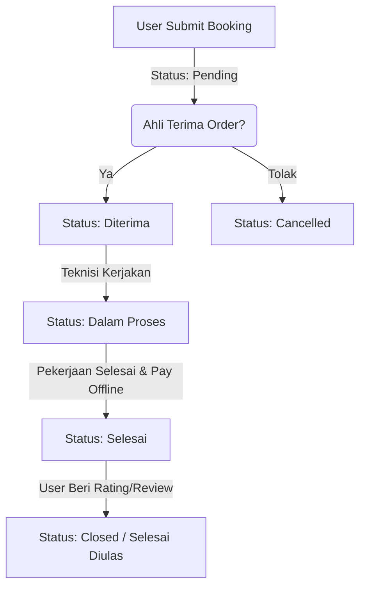

# 🚀 HelpIO Backend API Documentation

> **Backend Integration Documentation & API Specification (Backend Specification)**
> Marketplace Jasa Offline Berbasis WhatsApp

---

## 📖 Deskripsi

Dokumen ini disusun untuk memudahkan tim **Backend Developer** dalam membangun RESTful API, perancangan Database Schema (ERD), serta logika bisnis sistem marketplace jasa offline **HelpIO**.

---

# 📋 1. Ringkasan Sistem & Konsep Bisnis

**HelpIO** adalah platform marketplace jasa offline yang mempertemukan pelanggan (User) dengan penyedia jasa profesional/teknisi (Ahli).

### Konsep Bisnis

* **Metode Pembayaran**: **100% Offline (Cash / COD / Transfer Langsung)**. Backend **TIDAK PERLU** mengintegrasikan Payment Gateway online (Midtrans, Xendit, dll).
* **Komunikasi**: Tidak ada fitur live-chat internal. Komunikasi dilakukan langsung melalui **WhatsApp** (`https://wa.me/{phone}`).
* **Otentikasi**: Berbasis Token JWT (`Bearer Token`) dengan verifikasi nomor WhatsApp OTP (mock/real WA gateway).

---

# 👥 2. Role Pengguna (User Roles)

| Role       | Deskripsi                                                                                                                                        |
| ---------- | ------------------------------------------------------------------------------------------------------------------------------------------------ |
| **USER**   | Pelanggan yang mencari jasa, melakukan booking, mengelola order, menyimpan favorit, dan memberikan ulasan.                                       |
| **EXPERT** | Ahli / Penyedia Jasa yang mengelola layanan jasa & harga, menerima/menolak order, memperbarui status pengerjaan, dan mengunggah portofolio.      |
| **ADMIN**  | Administrator yang melakukan verifikasi identitas ahli (KTP/Sertifikat), mengelola pengguna & ahli, kelola kategori, serta moderasi ulasan spam. |

---

# 🗄️ 3. Perancangan Skema Database (Database Schema / ERD)

Berikut adalah struktur entitas relasional (PostgreSQL / MySQL) atau dokumen (MongoDB) yang wajib disediakan backend.

---

## 3.1 Tabel `users`

| Nama Kolom   | Tipe Data             | Keterangan                                       |
| ------------ | --------------------- | ------------------------------------------------ |
| `id`         | VARCHAR/UUID (PK)     | Unique ID (contoh: `usr_101`)                    |
| `name`       | VARCHAR(100)          | Nama lengkap pengguna                            |
| `email`      | VARCHAR(100) (UNIQUE) | Email pengguna                                   |
| `password`   | VARCHAR(255)          | Password terenkripsi (Bcrypt)                    |
| `phone`      | VARCHAR(20)           | Nomor WhatsApp aktif (format `08xxx` / `628xxx`) |
| `role`       | ENUM                  | `'user'`, `'expert'`, `'admin'`                  |
| `avatar`     | TEXT                  | URL foto profil                                  |
| `address`    | TEXT                  | Alamat utama pengguna                            |
| `created_at` | TIMESTAMP             | Waktu pendaftaran                                |

---

## 3.2 Tabel `experts` (Mitra Ahli)

| Nama Kolom            | Tipe Data         | Keterangan                                            |
| --------------------- | ----------------- | ----------------------------------------------------- |
| `id`                  | VARCHAR/UUID (PK) | Unique ID ahli (contoh: `exp_1`)                      |
| `user_id`             | VARCHAR/UUID (FK) | Relasi ke `users.id`                                  |
| `category_id`         | VARCHAR/UUID (FK) | Relasi ke `categories.id`                             |
| `location`            | VARCHAR(100)      | Kota/Kecamatan operasional                            |
| `experience`          | VARCHAR(50)       | Contoh: `"8 Tahun"`                                   |
| `rating`              | DECIMAL(2,1)      | Average rating (default `0.0`, max `5.0`)             |
| `review_count`        | INT               | Jumlah ulasan yang diterima                           |
| `completed_jobs`      | INT               | Jumlah pengerjaan selesai                             |
| `starting_price`      | DECIMAL(12,2)     | Patokan harga mulai                                   |
| `banner`              | TEXT              | URL gambar banner profil                              |
| `bio`                 | TEXT              | Deskripsi keahlian                                    |
| `operating_hours`     | VARCHAR(100)      | Contoh: `"Senin - Sabtu (08.00 - 18.00)"`             |
| `verified`            | BOOLEAN           | `true` jika disetujui Admin, default `false`          |
| `verification_status` | ENUM              | `'pending'`, `'approved'`, `'rejected'`, `'revision'` |

---

## 3.3 Tabel `expert_services` (Layanan Jasa Ahli)

| Nama Kolom    | Tipe Data         | Keterangan                           |
| ------------- | ----------------- | ------------------------------------ |
| `id`          | VARCHAR/UUID (PK) | Unique ID layanan                    |
| `expert_id`   | VARCHAR/UUID (FK) | Relasi ke `experts.id`               |
| `title`       | VARCHAR(150)      | Contoh: `"Cuci AC Split 0.5 - 2 PK"` |
| `price`       | DECIMAL(12,2)     | Harga layanan                        |
| `est_time`    | VARCHAR(50)       | Contoh: `"45 Menit"`                 |
| `description` | TEXT              | Penjelasan pengerjaan                |
| `status`      | ENUM              | `'active'`, `'inactive'`             |

---

## 3.4 Tabel `orders` (Pemesanan Jasa)

| Nama Kolom       | Tipe Data         | Keterangan                                                                                      |
| ---------------- | ----------------- | ----------------------------------------------------------------------------------------------- |
| `id`             | VARCHAR(20) (PK)  | Format Kode Order (contoh: `ORD-9921`)                                                          |
| `user_id`        | VARCHAR/UUID (FK) | Relasi ke `users.id`                                                                            |
| `expert_id`      | VARCHAR/UUID (FK) | Relasi ke `experts.id`                                                                          |
| `service_title`  | VARCHAR(150)      | Layanan yang dipilih                                                                            |
| `price`          | DECIMAL(12,2)     | Total harga kesepakatan awal                                                                    |
| `address`        | TEXT              | Alamat lokasi pengerjaan                                                                        |
| `date`           | DATE              | Tanggal pengerjaan requested                                                                    |
| `time`           | TIME              | Jam kedatangan requested                                                                        |
| `description`    | TEXT              | Keluhan / deskripsi masalah                                                                     |
| `photo_url`      | TEXT (NULLABLE)   | Foto kendala                                                                                    |
| `notes`          | TEXT (NULLABLE)   | Catatan tambahan untuk ahli                                                                     |
| `status`         | ENUM              | `'Pending'`, `'Diterima'`, `'Dalam Proses'`, `'Selesai'`, `'Review'`, `'Closed'`, `'Cancelled'` |
| `payment_method` | VARCHAR(100)      | Default: `"Cash / COD / Transfer Langsung Offline"`                                             |
| `created_at`     | TIMESTAMP         | Waktu pembuatan order                                                                           |

---

## 3.5 Tabel `reviews`

| Nama Kolom   | Tipe Data         | Keterangan                    |
| ------------ | ----------------- | ----------------------------- |
| `id`         | VARCHAR/UUID (PK) | Unique ID ulasan              |
| `order_id`   | VARCHAR(20) (FK)  | Relasi ke `orders.id`         |
| `expert_id`  | VARCHAR/UUID (FK) | Relasi ke `experts.id`        |
| `user_id`    | VARCHAR/UUID (FK) | Relasi ke `users.id`          |
| `rating`     | INT               | Rating bintang `1` sampai `5` |
| `comment`    | TEXT              | Isi ulasan ulasan             |
| `created_at` | TIMESTAMP         | Tanggal ulasan                |

---

## 3.6 Tabel `expert_verifications` (Dokumen Verifikasi Admin)

| Nama Kolom        | Tipe Data         | Keterangan                                            |
| ----------------- | ----------------- | ----------------------------------------------------- |
| `id`              | VARCHAR/UUID (PK) | Unique ID verifikasi                                  |
| `expert_id`       | VARCHAR/UUID (FK) | Relasi ke `experts.id`                                |
| `ktp_url`         | TEXT              | Gambar KTP terunggah                                  |
| `certificate_url` | TEXT              | Gambar sertifikat keahlian                            |
| `status`          | ENUM              | `'pending'`, `'approved'`, `'rejected'`, `'revision'` |
| `submitted_at`    | TIMESTAMP         | Waktu pengajuan berkas                                |

---

# 📡 4. Spesifikasi Endpoints API (REST API Contracts)

## 4.1 Autentikasi (`/api/auth`)

```http
POST /api/auth/register-user
POST /api/auth/register-expert
POST /api/auth/verify-otp
POST /api/auth/login
GET  /api/auth/me
```

---

## 4.2 Kategori & Jasa (`/api/categories` & `/api/experts`)

```http
GET /api/categories
GET /api/experts
GET /api/experts/:id
```

**Query Params Filter**

```text
?q=ac
&cat=Service%20AC
&verified=true
&min_rating=4.5
&sort=rating|price|jobs
```

---

## 4.3 Manajemen Pemesanan (`/api/orders`)

```http
POST  /api/orders
GET   /api/orders/user
GET   /api/orders/expert
PATCH /api/orders/:id/status
```

---

## 4.4 Moderasi Admin (`/api/admin`)

```http
GET    /api/admin/verifications
PATCH  /api/admin/verifications/:id
GET    /api/admin/users
DELETE /api/admin/reviews/:id
```

---

# 🔄 5. Siklus Pipeline Status Order (State Machine)



---

# 📱 6. Logika Format Integrasi WhatsApp

Sistem frontend tidak memproses obrolan pesan di dalam database internal.

Tombol chat WhatsApp akan membuka link resmi berikut.

```text
https://wa.me/{PhoneFormat62}?text={URLEncode(Message)}
```

Formula:

$$
\text{URL} = \text{https://wa.me/} + \text{PhoneFormat62} + \text{?text=} + \text{URLEncode(Message)}
$$

* Format nomor WhatsApp di database wajib diawali dengan kode negara tanpa simbol `+` (contoh: `6281234567890`).

---

# 🔒 7. Keamanan & Konfigurasi CORS

## Header Authorization

Setiap request terproteksi wajib mengirimkan header:

```http
Authorization: Bearer <token_jwt>
```

## CORS Configuration

Izinkan domain frontend.

Contoh:

```text
http://localhost:5173
```

## HTTP Status Codes

| Status                      | Keterangan                             |
| --------------------------- | -------------------------------------- |
| `200 OK`                    | Pemrosesan sukses                      |
| `201 Created`               | Pemrosesan sukses                      |
| `400 Bad Request`           | Validasi input gagal                   |
| `401 Unauthorized`          | Token JWT tidak valid / expired        |
| `403 Forbidden`             | Role pengguna tidak memiliki hak akses |
| `500 Internal Server Error` | Kendala pada server backend            |

---

## 📌 Penutup

Dokumentasi ini siap diserahterimakan kepada tim Backend Developer untuk memulai perancangan basis data dan pembuatan REST API HelpIO.
